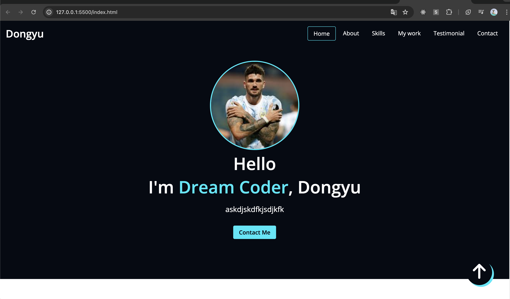

# Portfolio

나의 포트폴리오 사이트

## 1주차

1. 스크롤 내렸을 때 헤더 검정으로
2. 스크롤 내렸을 때 홈 화면 투명하게
3. 스크롤 내렸을 때 화살표 숨기기

## 2주차

1. 모바일 메뉴 구현
2. 프로젝트 필터링하기

### 1주차 세부 내용

#### 1. 스크롤 내렸을 때 헤더 검정으로

스크롤을 내리면 헤더의 배경색이 검정으로 변하도록 구현합니다. 사용자에게 스크롤 상태를 직관적으로 알릴 수 있습니다.

#### 2. 스크롤 내렸을 때 홈 화면 투명하게

홈 화면의 배경이 스크롤에 따라 점점 투명해지도록 구현합니다. 자연스러운 전환 효과를 제공합니다.

#### 3. 스크롤 내렸을 때 화살표 숨기기

화살표 아이콘이 스크롤을 내리면 사라지도록 합니다. 이는 인터페이스의 깔끔함을 유지하기 위함입니다.

1. 사용자가 페이지를 스크롤할 때 감지하기 위해 어떤 JavaScript 이벤트를 사용해야 할까요?
2. 페이지의 현재 스크롤 위치를 어떻게 가져올 수 있을까요?
3. 헤더의 색은 어떻게 변경할수 있을까?

### 2주차 세부 내용

#### 1. 모바일 메뉴 구현

모바일 환경에서의 사용자 경험을 향상시키기 위해 모바일 메뉴를 구현합니다. 다음과 같은 사항을 포함합니다:

- 햄버거 메뉴 버튼 추가
- 메뉴 슬라이드 애니메이션
- 반응형 레이아웃 적용

#### 2. 프로젝트 필터링하기

사용자가 프로젝트 목록을 필터링할 수 있도록 기능을 추가합니다. 다음과 같은 사항을 포함합니다:

- 필터 버튼 및 드롭다운 메뉴 추가
- 필터링 로직 구현
- 필터 적용 시 프로젝트 목록 갱신

  - 
